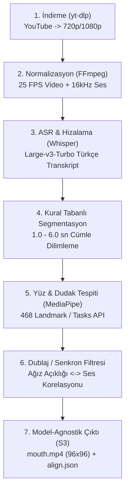

# 📚 Türkçe Dudak Okuma Veri Kümesi Rehberi (Dataset Guide)

Bu doküman; projede kullanılan Türkçe dudak okuma veri kümesinin **nasıl elde edildiğini**, **mimari ve kalite filtreleme kurallarını**, **S3 veri deposu hiyerarşisini** ve **veriye nasıl erişilip indirileceğini** ayrıntılı olarak açıklamaktadır.

---

## 1. Veri Kümesi Künyesi ve İstatistikleri

* **Kaynak:** 466 tek-konuşmacılı, frontal (önden çekilmiş) Türkçe YouTube videosu (TEDx, üniversite ders ve konferansları, oturarak yapılan röportajlar ve monologlar).
* **Toplam Kabul Edilen Segment Sayısı:** 75.273 segment (~28.4+ saat doğrulanmış görsel konuşma).
* **Toplam Kelime Sayısı:** 962.903 kelime (ASR transkripsiyonu ile doğrulanmış).
* **Format:**
  * `mouth.mp4`: 96×96 piksel, gri tonlamalı (grayscale), 25 FPS, 68-noktalı ortalama yüze hizalanmış dudak ROI (Auto-AVSR uyumlu).
  * `align.json`: Cümle metni ve kelime düzeyinde başlangıç/bitiş zaman damgaları.
  * `meta.json`: Segment süresi, dublaj korelasyon skoru, tespit edilen kare sayıları.
  * `face.mp4`: 224×224 piksel RGB, 25 FPS tam yüz klibi.
  * `audio.wav`: 16 kHz mono eşlenik ses kaydı.
* **Bölme Stratejisi (Splits):** Konuşmacı-ayrık (speaker-disjoint) `train`, `val`, `test` dağılımı (`data/metadata/split_map.json`).

---

## 2. Veri Nasıl Elde Edildi? (6 Aşamalı İdempotent Boru Hattı)

Veri toplama süreci, rastgele videolardan dudak kırpmak yerine, **LRS3 standartlarında** ve **idempotent** (çökme sonrası kaldığı yerden devam edebilen) 6 aşamalı bir boru hattıyla yürütülmüştür:



### Aşama Detayları ve Kalite Kriterleri

1. **Seçici Kaynak Kürasyonu (`data/metadata/sources.txt`):**
   * Yalnızca tek konuşmacının doğrudan kameraya baktığı videolar seçilmiştir.
   * Geniş plan kalabalık sahneler ve hızlı kesimli vloglar elenmiştir (yüz boyutunun en az 100 piksel olması şartı `MIN_FACE_PX = 100`).
2. **ASR ve Kelime Damgalama (`whisper-large-v3-turbo`):**
   * Whisper modeli ile Türkçe ses deşifre edilmiş, her kelimenin mikrosaniyelik başlangıç ve bitiş zamanları (`align.json`) çıkarılmıştır.
3. **LRS3 Uyumlu Segmentasyon:**
   * Cümleler en az 1.0 saniye (`MIN_CLIP_SEC`), en fazla 6.0 saniye (`MAX_CLIP_SEC`) ve azami 100 karakter (`MAX_CLIP_CHARS`) olacak şekilde doğal konuşma duraklamalarından bölünmüştür.
4. **MediaPipe Tasks API ile Yüz Takibi:**
   * Yüzün 468 referans noktası tespit edilmiş; dudak köşeleri ve dudak açıklığı çıkartılmıştır.
5. **Segment Bazlı Dublaj / Senkronizasyon Filtresi (`DUB_CORR_THRESHOLD = 0.15`):**
   * Dudak hareketinin ses şiddetiyle uyuşmadığı (dublajlı veya arkadan seslendirilen) sahneler, ağız açıklığı sinyali ile ses zarfı arasındaki Pearson korelasyonu hesaplanarak elenmiştir. Korelasyon $\rho < 0.15$ olan segmentler veri setine dahil edilmemiştir.
6. **Auto-AVSR Uyumlu Dudak Kırpması:**
   * `vendor/auto_avsr/20words_mean_face.npy` referans yüz modeli kullanılarak afin dönüşüm (affine transformation) ile kafa hareketleri dengelenmiş ve 96×96 gri dudak bölgesi (`mouth.mp4`) üretilmiştir.

---

## 3. S3 Kova Hiyerarşisi ve Boyut Dağılımı

Veriler AWS S3 üzerinde aşağıdaki yapıda depolanmaktadır:

* **S3 Kovası:** `s3://lipreading-data-emre2026/`
* **AWS Bölgesi:** `us-east-1`

```text
s3://lipreading-data-emre2026/
├── master/                      # Ana veri seti (466 video, 75.273 segment)
│   └── <video_id>/
│       └── <segment_id>/
│           ├── mouth.mp4        # 96x96 gri tonlama 25 FPS dudak ROI (4.62 GiB)
│           ├── align.json       # Kelime damgalı transkript (0.06 GiB / ~60 MB)
│           ├── meta.json        # Segment metadata ve dublaj skoru (0.01 GiB)
│           ├── face.mp4         # 224x224 RGB 25 FPS tam yüz (20.44 GiB)
│           └── audio.wav        # 16 kHz mono ses (13.17 GiB)
├── ckpt/
│   └── vsr_trlrs3_base.pth      # Transfer learning temel modeli (~1 GiB)
└── kosu/
    └── <deney_adi>/             # Eğitim checkpoint'leri ve metrics.csv
```

> [!TIP]
> **Tasarruf İpucu:** Model eğitimi için yalnızca `mouth.mp4`, `align.json` ve `meta.json` gereklidir. `face.mp4` (20 GB) ve `audio.wav` (13 GB) indirilmeden **yalnızca ~4.7 GiB** indirilerek tüm veri setiyle eğitim yapılabilir.

---

## 4. Veriye Erişim ve İndirme

Projede yer alan `scripts/download_s3_dataset.py` aracı çoklu iş parçacığıyla (varsayılan 48 thread) hızlı indirme sağlar.

### A. Kimlik Bilgilerini Tanımlama
`.env.example` dosyasını `.env` olarak kopyalayıp kendi anahtarlarınızı yazın
(gerçek anahtarları asla repoya commitlemeyin):
```bash
cp .env.example .env
# .env içine:
S3_BUCKET_NAME=YOUR_S3_BUCKET_NAME
AWS_DEFAULT_REGION=us-east-1
AWS_ACCESS_KEY_ID=YOUR_AWS_ACCESS_KEY_ID
AWS_SECRET_ACCESS_KEY=YOUR_AWS_SECRET_ACCESS_KEY
HF_TOKEN=YOUR_HF_TOKEN  # büyük veri: avsr-tr-ekip/avsr-tr-dataset
```

### B. İndirme Komutları

```bash
# 1. Yalnızca eğitim için gereken dosyaları indir (~4.7 GiB) -> data/master/
python scripts/download_s3_dataset.py --mode mouth

# 2. Transfer learning temel model ağırlığını indir (~1 GiB) -> checkpoints/vsr_trlrs3_base.pth
python scripts/download_s3_dataset.py --mode ckpt

# 3. Yalnızca transkriptleri ve etiketleri indir (~70 MB)
python scripts/download_s3_dataset.py --mode align

# 4. Hızlı test için yalnızca ilk 100 dosyayı indir
python scripts/download_s3_dataset.py --mode mouth --limit 100

# 5. Yalnızca test kümesine ait videoları indir
python scripts/download_s3_dataset.py --mode mouth --split test
```

Alternatif olarak doğrudan `awscli` ile indirmek isterseniz:
```bash
aws s3 sync s3://lipreading-data-emre2026/master data/master \
    --exclude "*" \
    --include "*/mouth.mp4" \
    --include "*/align.json" \
    --include "*/meta.json" \
    --only-show-errors
```

---

## 5. Konuşmacı-Ayrık (Speaker-Disjoint) Bölme (`split_map.json`)

Dudak okuma modellerinde en yaygın hata, aynı konuşmacının hem eğitim hem test kümesinde yer almasıdır. Bu durum modelin dudak hareketlerini okumak yerine konuşmacının yüz anatomisini ezberlemesine (identity memorization) yol açar.

Bu sorunu önlemek için:
* `data/metadata/split_map.json` dosyasında 466 videonun her biri ait olduğu kanal veya konuşmacıya göre gruplanmıştır.
* Aynı konuşmacıya ait tüm videolar yalnızca tek bir kümeye (train, val veya test) tahsis edilmiştir.
* TEDx gibi tek bir kanalda birden çok konuşmacı barındıran toplayıcı kanallar konuşmacı bazında ayrılmıştır.

---

## 6. Türkçe Tokenizer (`data/metadata/tokenizer/`)

Auto-AVSR ve CTC modelleri için eğitilmiş Türkçe SentencePiece Unigram tokenizer'ı:
* `data/metadata/tokenizer/unigram5000.model` (3000 kelime/parça boyutu)
* `data/metadata/tokenizer/unigram5000.vocab`
* `data/metadata/tokenizer/unigram5000_units.txt`
* **Eğitim Korpusu:** 75.273 Türkçe cümle, 962.903 kelime.
* **Kapsama:** Sıfır `<unk>` tokeni ile eksiksiz Türkçe karakter ve hece desteği.

---

## 7. Manifest Üretimi ve Eğitime Başlama

S3'ten veriler indirildikten sonra eğitim manifest CSV dosyalarını oluşturmak için:

```bash
python scripts/build_dataset_manifest.py
```

Bu komut `data/master/` klasörünü tarar ve `split_map.json` ile eşleştirerek şu dosyaları üretir:
* `data/metadata/train.csv`
* `data/metadata/val.csv`
* `data/metadata/test.csv`

Bu CSV'ler `configs/baseline_ctc.yaml` konfigürasyonuna ve `src/dataset/dataset.py` veri yükleyicisine doğrudan bağlanır.
